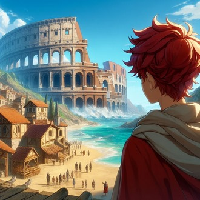
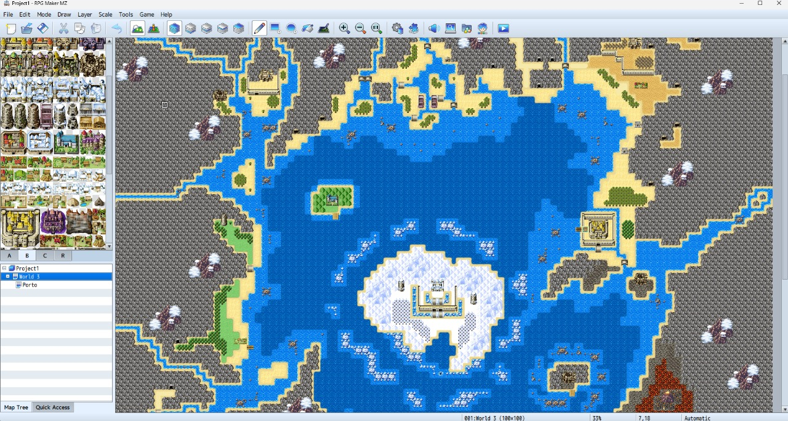
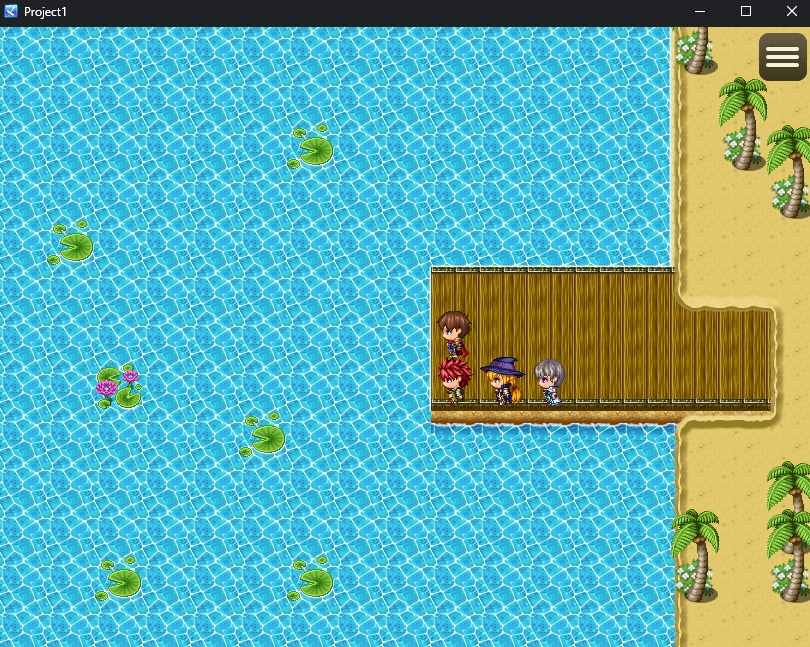
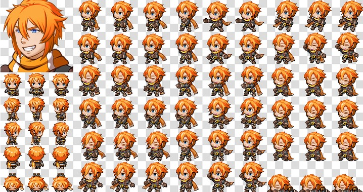

# **Attlanus**
Attlanus é um jogo desenvolvido em RPG maker MZ para a unidade curricular Usabilidade, desenvolvimento web, mobile e jogos.
- [Sinopse](#sinopse)

## Sinopse
Reef é um menino que sempre sonhou em ver a cidade Attlanus, uma cidade além mar. Qualquer coisa além mar é proibido na vila de Reef, a menos que você prove que é forte no coliseu, e ganhe a permissão para sair da vila

## Imagens

- Arte conceitual do jogo

- Primeira versão de asset do mundo (A ser editado)

- Primeira cena do jogo, onde o protagonista irá repensar nos seus sonhos e definir suas motivações.

- Sprites do personagem principal da trama

- Primeira versão do NPC mercante que estará presente no mundo inteiro

